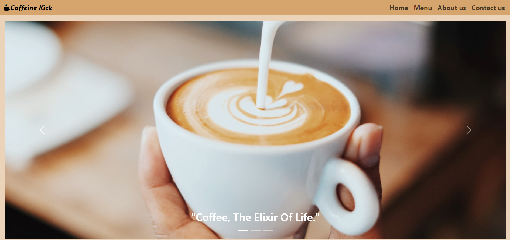
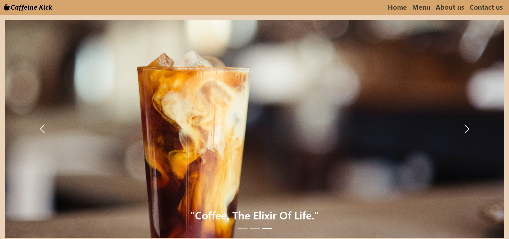
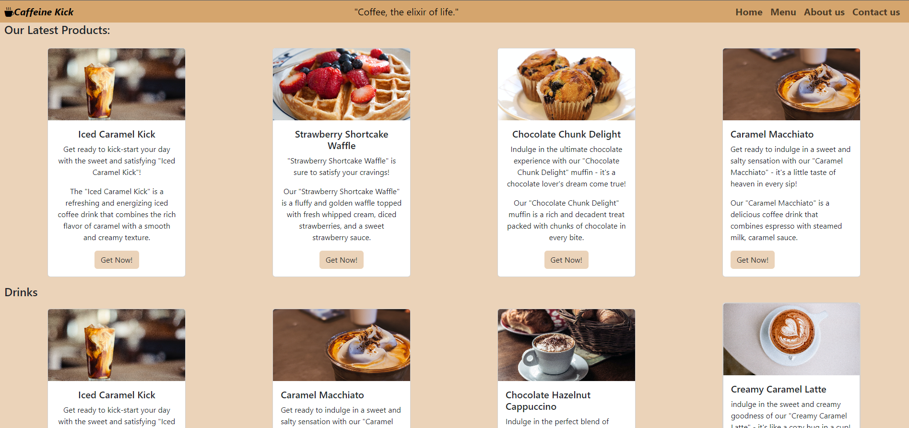
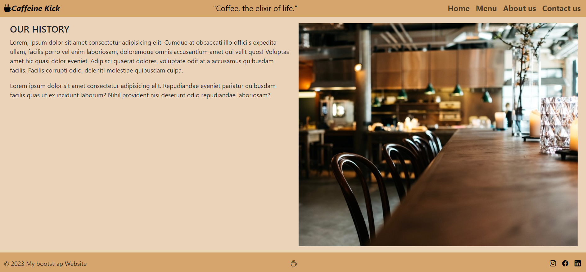
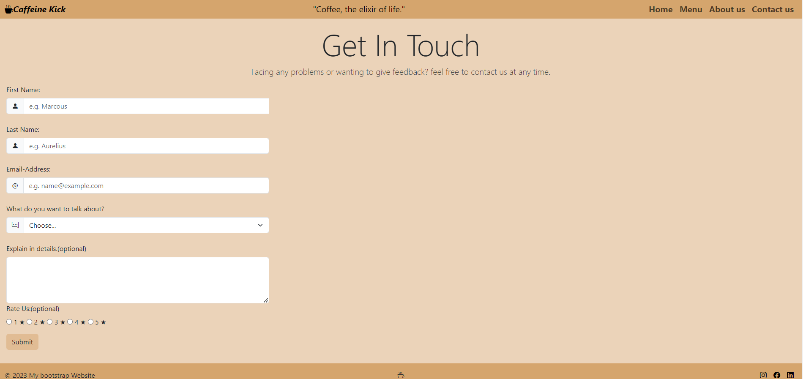
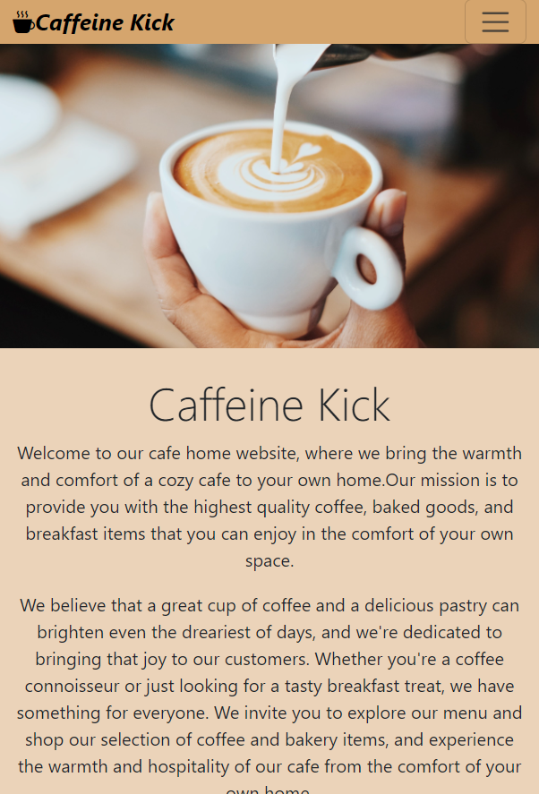
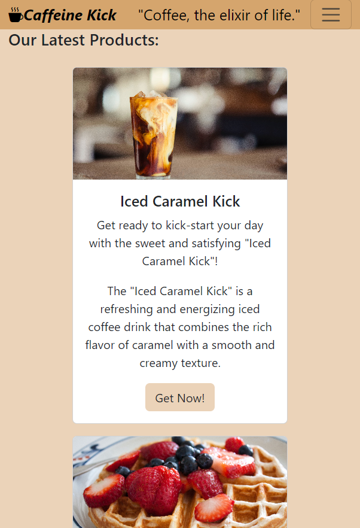

# Boostrap-Responsive-Project-net-cafe
This is a project Realted to GDSC Google Development Students CLub 
where we were asked to make a fully responsive Net Cafe Website and i choose to do it using Bootstrap to learn more about it.
## Sample Screenshots from the website
### Home Page

### Menu

### About us

### Contact us

### Responsivness

